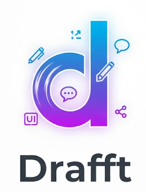

# Drafft.ink – Infinite Canvas. Zero Subscription.
> Designed for collaboration, not for venture capitalists.

## What in the Actual Drafft is This?



**DrafftInk** is a high-performance, cross-platform, digital whiteboard with collaboration support I wish existed, but didn't. This isn't your flaky, laggy browser tab. This is a **native application experience**.

A whiteboard should be open source and fast, and never be contained by proprietary software. So, I wrote it in the language everyone loves to talk about, slapped a beautiful, native-feeling GUI on it with **egui**, and made it sing on every platform—desktop, web, whatever—using the magic of **WebGPU**.

<br clear="left"/>

### The Origin Story (The Trauma)

Did you actually just ask that? Do you really need a why?

My week-long struggle with **zero documentation** and **patchy TypeScript**
ended in a brutal realization: **I was a peasant asking to use their private
jet.** They had zero intention of letting anyone actually self-host.

The natural question arose: "How hard could it actually be?".
(Spoiler: Hard enough, but now it's done.)

-----

## Performance & Philosophy

**Rust** and **WebGPU** mean this thing is faster than your caffeine habit.
The WebSocket backend is built for speed, not for vendor lock-in. Real-time,
updates, it's like having your team in the same room,
but without having to smell Kevin's tuna sandwich.

### Key Features

  * **Cross-Platform Sanity:** Works on Linux, Windows, macOS, and in your browser. No excuses.
  * **Real-Time Multi-User:** Watch your team members draw their terrible ideas on the same canvas.
  * **Open Format:** Export your masterpiece to **PNG** and **JSON**. Your data is **yours**. Forever.
  * **Source Code You Can Trust:** It's all right here. No hidden telemetry, no third-party tracking, no corporate shenanigans.

## Installation (You're an Adult, You've Got This)

I've made it almost as easy as installing an over-engineered Node app.

```bash
# This assumes you have Rust, Cargo, and necessary targets installed.
git clone https://github.com/drafft-ink/drafft-ink.git
cd drafft-ink
```

### Native Desktop Version

```bash
# Compile and run the desktop application (Linux/macOS/Windows)
cargo run --release
# OR use the script
./build.sh --native
```

### Web (WASM) Version

The WebGPU version is hosted, so you can just go to **drafft.ink**. To build and run it locally:

```bash
# Builds the WASM target and serves it locally for testing
./build.sh --wasm
```

-----

## The Open-Source Gospel

Seriously, this entire project is built on the philosophy that you should own your own tools and data.

I won't charge you for a sticky note. That's a promise. I'm not selling you a service; I'm giving you a tool.

### The AI Code Disclosure (Let's Be Real)

Let's address the inevitable GitHub issue comment now:

  * **YES,** some of this code was helped along by AI. Let's face it, once you treat AI as an **uninformed over-confident intern**, it works well (to some extent).
  * **NO,** it's not all hallucinated boilerplate code.
  * **YES, I can write actual Rust code** (and enjoy it). The core architecture and most initial draft of it have been typed out by human fingers.

Don't like it? The source is right here. **Prove me wrong** by submitting a human-written, better implementation\! That's the beauty of open source.

## License

**AGPLv3** – This is my guarantee: no corporate lock-in, even as a web service.

-----

**Go forth and drafft\!**
