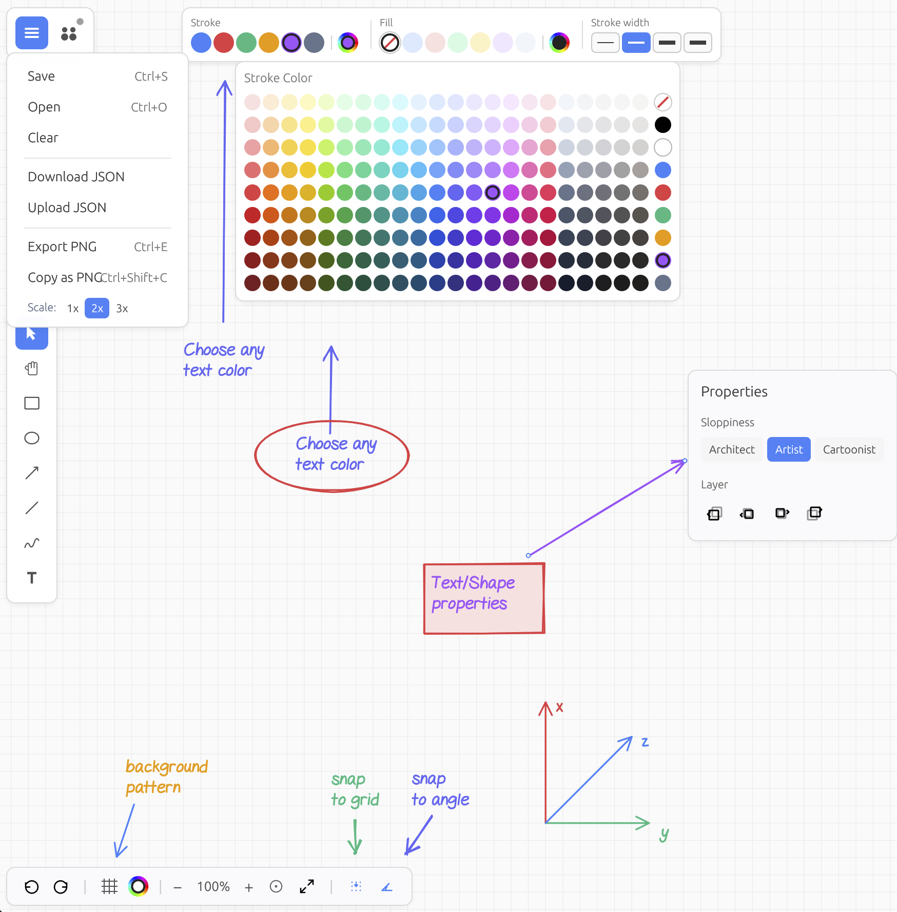

# Drafft.ink


**An infinite canvas whiteboard built with Rust and WebGPU.**

Try it now: [drafft.ink](https://drafft.ink/) — draw first, sign up never.

Cross-platform (Linux, Windows, macOS, browser, mobile). Real-time collaboration via CRDTs. No account required. Self-hostable with a single binary.

<br clear="left"/>



---

## Features

- **Shapes and Drawing** - Rectangles, ellipses, lines, arrows, freehand paths with pressure sensitivity
- **Smart Guides** - Smart alignment snapping, equal spacing detection, angle snapping
- **Text** - Multiple font families (GelPen, GelPen Serif, Vanilla Extract), per-character styling, inline LaTeX math
- **Images** - Drag-and-drop, paste from clipboard, embedded in document
- **Collaboration** - Real-time sync via Loro CRDT. Watch your colleagues draw boxes around things that don't need boxes.
- **Open Formats** - Export to PNG or JSON. Import them back.
- **No Telemetry** - We don't know what you're drawing, and frankly, we don't want to.
- **Touch Support** - iPad and tablet friendly, gesture navigation
- **Sketch Style** - Sketchy on purpose. Precise when it matters. Hand-drawn aesthetic via roughr and fonts

---

## Installation

### Desktop

```bash
git clone https://github.com/PatWie/drafft-ink.git
cd drafft-ink
cargo run --release
```

Or use the build script:

```bash
./build.sh --native
```

### Web (Local)

```bash
./build.sh --wasm
```

### Collaboration Server

```bash
cargo build --release -p drafftink-server
./target/release/drafftink-server
```

Listens on `ws://localhost:3030/ws`. One binary, no configuration files. Self-host it. Or don't. We're not your manager.

---

## Architecture

```
crates/
  drafftink-core/     # Canvas state, shapes, CRDT sync, snapping logic
  drafftink-render/   # Vello-based GPU rendering, text layout (Parley)
  drafftink-app/      # Application logic, UI (egui), event handling
  drafftink-server/   # WebSocket collaboration server
  drafftink-widgets/  # Custom UI components
```

---

## Philosophy

Your tools should work for you. No accounts, no paywalls, no telemetry, no "upgrade to Pro."

---

## Contributing

PRs welcome. Issues welcome. The code is right here.

---

## License

**AGPLv3** - Use it, modify it, host it. Keep it open.
